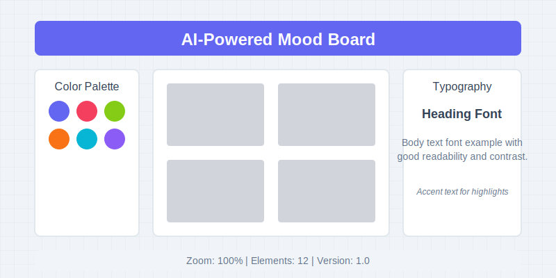

# 🎨 AI-Powered Mood Board Generator

<div align="center">


**Transform abstract concepts into visually stunning, cohesive mood boards with AI**

<p align="center">
  
</p>

</div>

## ✨ Features

- **🧠 Intelligent Theme Interpretation** - Process natural language prompts to generate cohesive design elements
- **🖼️ Dynamic Canvas** - Responsive drag-and-drop interface with zoom, pan and custom layout options
- **🎭 AI-Generated Elements** - Custom imagery, color palettes, typography pairings, and textures
- **🔧 Interactive Customization** - Fine-tune every element with intuitive controls
- **📤 Export & Share** - Multiple export formats and shareable links with permission settings

## 🚀 Quick Start

### Prerequisites

- Node.js 16.0+
- npm or yarn

### Installation

```bash
# Clone the repository
git clone https://github.com/mDev-AI/mood-board-react.git
cd mood-board-react

# Install dependencies
npm install

# Start development server
npm run dev
```

Then open [http://localhost:5173](http://localhost:5173) in your browser.

## 💻 Usage

<table>
<tr>
<td width="50%">

### 1️⃣ Enter a Theme Prompt

Type a descriptive theme like "Mediterranean summer with coastal vibes" or "Cyberpunk dystopia with organic elements"

### 2️⃣ Explore Generated Elements

Browse AI-suggested images, colors, typography, and textures

### 3️⃣ Build Your Mood Board

Drag elements to the canvas and arrange your composition

</td>
<td width="50%">

### 4️⃣ Customize Elements

Adjust colors, fonts, and properties to perfect your vision

### 5️⃣ Export Your Creation

Download as PNG/JPEG/PDF or share via link

### 6️⃣ Iterate and Refine

Save versions and continue improving your design

</td>
</tr>
</table>

## 🛠️ Technology Stack

- **Frontend**: React 19, TypeScript, Tailwind CSS
- **State Management**: React Context API
- **UI Components**: Custom components with Framer Motion animations
- **Drag & Drop**: React DND
- **Routing**: React Router DOM

## 📁 Project Structure

```
mood-board/
├── src/
│   ├── components/     # Reusable UI components
│   ├── contexts/       # State management
│   ├── features/       # Feature modules
│   ├── hooks/          # Custom React hooks
│   ├── services/       # API services
│   ├── types/          # TypeScript types
│   └── utils/          # Utility functions
├── public/             # Static assets
└── ...                 # Config files
```

## 📝 License

MIT © [mDev-AI](https://github.com/mDev-AI)

## 🤝 Contributing

Contributions, issues and feature requests are welcome!

1. Fork the repository
2. Create your feature branch (`git checkout -b feature/amazing-feature`)
3. Commit your changes (`git commit -m 'Add some amazing feature'`)
4. Push to the branch (`git push origin feature/amazing-feature`)
5. Open a Pull Request

## 📞 Contact

Have questions or feedback? Reach out to us:

- Twitter: [@mDev_AI](https://twitter.com/mDev_AI)
- GitHub: [mDev-AI](https://github.com/mDev-AI)
